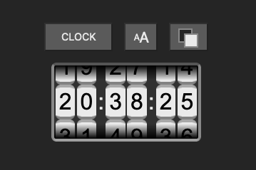
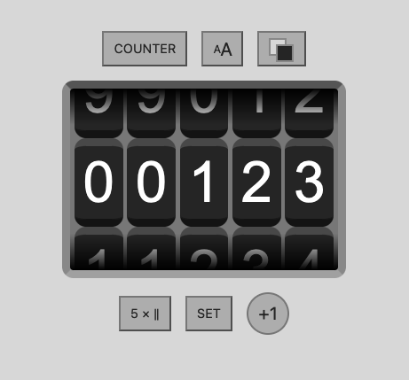

# Rotary Counter

A simple number counter with analog rotary wheels with animated rotation. Alternatively, it can just display the time. Implemented by utilizing [Web Components](https://developer.mozilla.org/en-US/docs/Web/Web_Components) technologies.

Top row buttons:
* Toggle mode CLOCK/COUNTER:
  * **Clock face** displays the current time in 24h format.
  * **Counter** displays a number that can be incremented by clicking the "+1" button, or set directly. The number of wheels can be changed.
* Select the size of the wheels
* Toggle Light/Dark theme

[See the demo](http://tapiocode.github.io/rotary-counter/)

# License

MIT License
